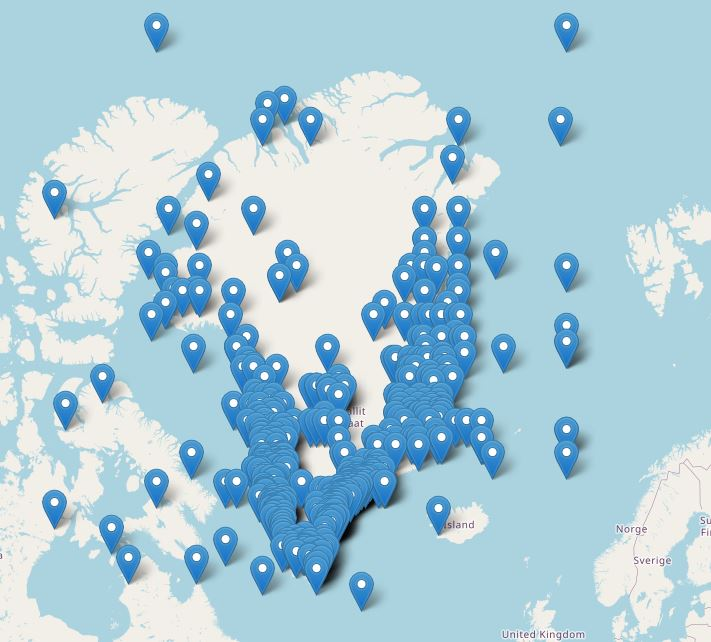

# SPRI_maps

This is my project that includes a Leaflet map.

You can view the interactive map [here](https://BiogeoscienceslabOxford/SPRImaps.github.io/SPRI_Map_GL.html)).

Here you can see the south shetland islands

You can view the interactive map [here](https://BiogeoscienceslabOxford/SPRImaps.github.io/SPRI_Map_SI.html)).
